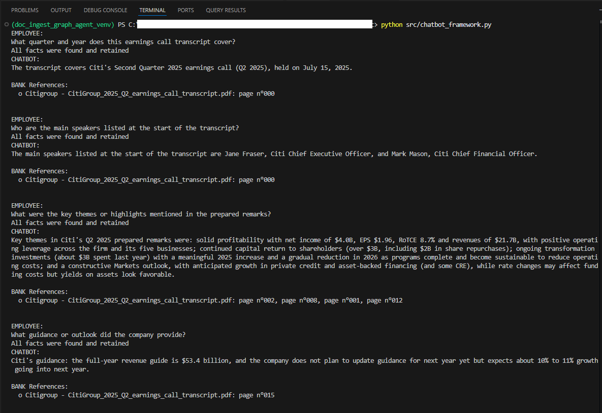

# Document Ingestion and Knowledge Graph Agent

An agentic system that ingests PDF documents, extracts structured facts into a Neo4j knowledge graph, and answers questions via an LLM over graph-based retrieval.

The project focuses on end-to-end ingestion, explicit graph structure, and inspectable retrieval, rather than opaque vector-only RAG.

## Quick start
1) Copy `.env.example` to `.env` and fill values.
2) Install dependencies: `pip install -r requirements.txt`.
3) Test Neo4j connection: `python scripts/test_neo4j_connection.py`.
4) Ingest PDFs: `python scripts/ingest_folder.py --path "C:\\path\\to\\pdfs"`.
5) Run the agent: `python src/chatbot_framework.py`.

## Ingestion workflow
Corpora are created from folder names. For example, `data/Citigroup/` becomes corpus `Citigroup`.

Single corpus (ingest one folder):
```powershell
python scripts/ingest_folder.py --path "C:\path\to\data\Citigroup"
```

Multiple corpora (ingest the whole `data/` tree):
```powershell
python scripts/ingest_folder.py --path "C:\path\to\data"
```

Add one new document to an existing corpus without duplicating old docs:
1) Temporarily move already‑ingested PDFs out of the corpus folder.
2) Run the ingest command on the corpus folder.
3) Move the old PDFs back.

Reset Neo4j (destructive, use only if you want a clean rebuild):
```cypher
MATCH (n) DETACH DELETE n;
```

## Example run (real output)
Below is a real terminal run from `python src/chatbot_framework.py` showing multiple questions answered against the Citigroup transcript in `data/`.



## Ingestion coverage (current)
As of the latest ingest:
- Banks: 3
- Documents: 7
- Pages: 159
- Facts: 908
- Questions: 158

## Configuration
Environment variables live in `.env` at the repo root. Start from `.env.example`.

Required:
- `NEO4J_URI`
- `NEO4J_PASSWORD`
- `OPENAI_API_KEY`

Optional:
- `NEO4J_USERNAME` (defaults to `neo4j`)
- `NEO4J_DEBUG` (set to `1` to enable Neo4j debug prints)

## Project layout
- `src/` : core source code
- `scripts/` : small utilities (like connection tests)
- `docs/` : lightweight documentation

## Models
This project uses two kinds of models:

1) Chat model (agent)
   - Default: `gpt-5-nano`
   - Location: `src/chatbot_framework.py` (`build_agent` call)
   - Change by editing the `llm_model` argument

2) Embedding model (retrieval + ingestion)
   - Default: `text-embedding-3-small` (cost-saving choice)
   - Locations: `src/process_graph.py`, `src/documentation_model.py`, `src/pdf_processor.py`
   - Change to `text-embedding-3-large` if you want higher quality

## Useful Cypher
Show a sample of the corpus -> document -> page chain:

```cypher
MATCH (c:CORPUS)-[:CONTAINS]->(d:DOCUMENT)-[:CONTAINS]->(p:PAGE)
RETURN c, d, p
LIMIT 25
```

## Status
The ingestion pipeline in `src/documentation_model.py` is partially implemented.
Stubs are still in place for summaries and best representation detection.
See `docs/DESIGN.md` for a full gap list and ordered todo items.

Cost note: PRA PDFs in `data/` are image-heavy and need OCR/vision to process; that adds cost.
For a low-cost start, prefer text-extractable PDFs and run a small pilot first.

## Known limitations
- Image-heavy or protected PDFs require OCR/vision; text extraction alone will be sparse.
- Retrieval quality depends on FACT nodes existing; if fact extraction fails, answers will be weak.
- Neo4j validation is manual (see `docs/queries/ingestion_validation.cypher` and `docs/ingestion_validation.md`).
- Index setup is not automated yet; performance is fine for small datasets only.
- PRA rulebooks are not used by the agent right now; the system prompt instructs the bot to skip PRA until OCR/vision is in place.

## Terminology
- Atomic fact: a minimal, standalone statement that can be verified from the page text without extra context.

## Cost baseline (early)
- Two ingestion runs on `CitiGroup_2025_Q2_earnings_call_transcript.pdf` each used 20,658 tokens.
- Working assumption: this personal project targets tens of pages, with headroom to scale later.
